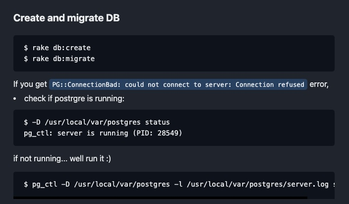
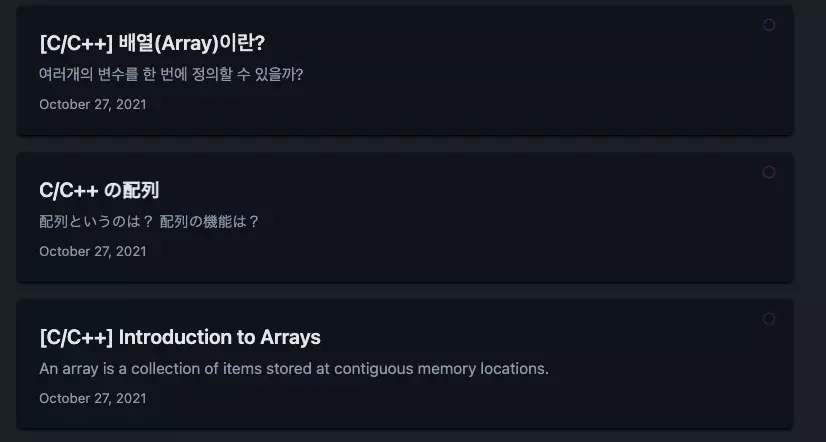
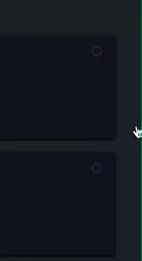

# Blue Blog

## Progress
- 2022-01-05
  + Inital blog created by following [this](https://nextjs.org/learn/basics/create-nextjs-app) tutorial from Next.js  
  + url modified --> `/posts/<post-language>/<slug>/`
- 2022-01-06
  + Attempted to add 'prism' for syntax highlighting but it didn't go well. After parsing markdown files, no classes were added to tags.
  + Started implementing the blog home UI
- 2022-01-07
  + Overall theme (blue-ish) defined. Utilized SASS's variable to set color schemes.
  + Finished posts (card style) UI using tailwindcss.
  + post's show (contents) UI done for now. Markdown not yet added but simply added a background color to differenciate with normal texts. 
  + Each post's language is labeled with a circle with an animation. 
    * Korean => Red + Blue + White
    * English => Blue
    * Japan => Red
  + Modified transition's to a keyframe animation. 
  + Footer added
  + Language selection added. I can click a lang to view only posts in that language.
    + I can also check available languages within a post.
- 2022-01-08
  + tagging added  