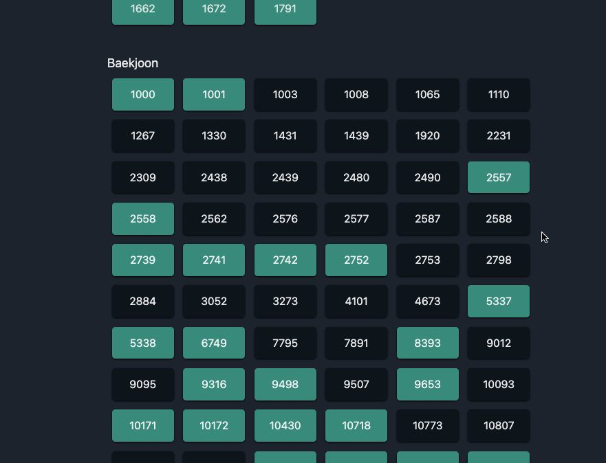
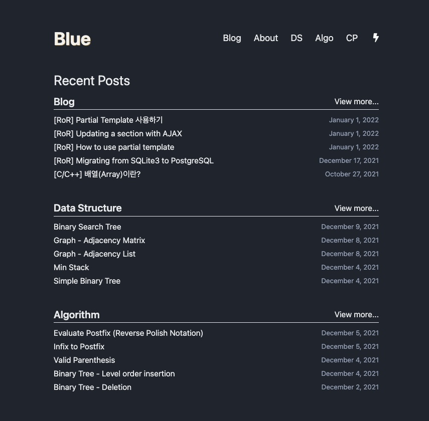
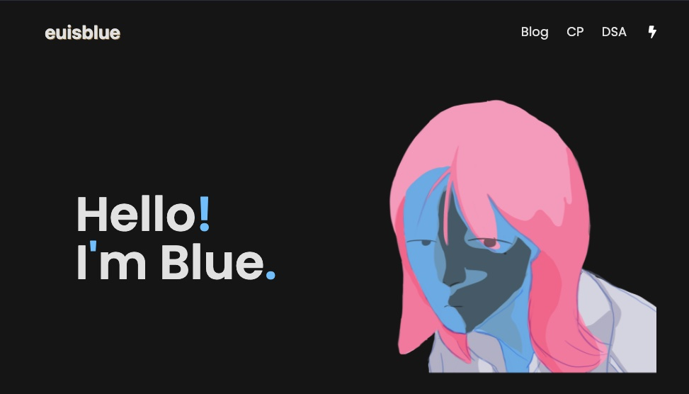
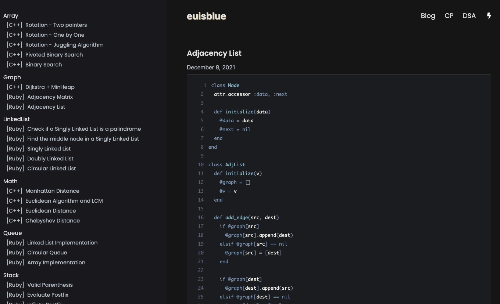
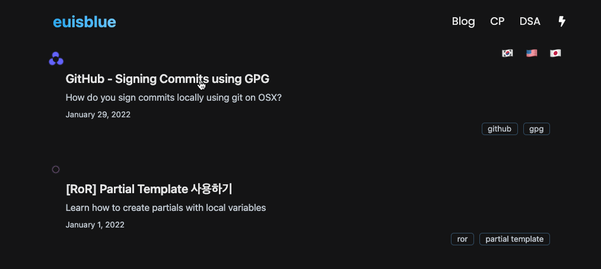
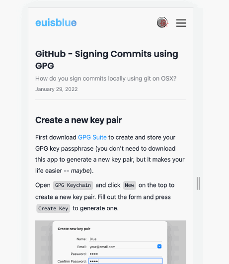

# [Blue Blog](http://euisblue.me/)

## Progress
- 2022-01-05
  + Inital blog created by following [this](https://nextjs.org/learn/basics/create-nextjs-app) tutorial from Next.js  
  + url modified --> `/posts/<post-language>/<slug>/`
- 2022-01-06
  + Attempted to add 'prism' for syntax highlighting but it didn't go well. After parsing markdown files, no classes were added to tags.
  + Started implementing the blog home UI
- 2022-01-07
  + Overall theme (blue-ish) defined. Utilized SASS's variable to set color schemes.
  + Finished posts (card style) UI using tailwindcss.
  + post's show (contents) UI done for now. Markdown not yet added but simply added a background color to differenciate with normal texts. 
  + Each post's language is labeled with a circle with an animation. 
    * Korean => Red + Blue + White
    * English => Blue
    * Japanese => Red
  + Modified transition's to a keyframe animation. 
  + Footer added
  + Language selection added. I can click a lang to view only posts in that language.
    + I can also check available languages within a post.
- 2022-01-08
<<<<<<< HEAD
  + tagging added  
- 2022-01-08
  + Dark/Light toggle added   
=======
  + tagging added  
- 2022-01-09
  + Markdown - syntax highlighting added
  + competitive programming section added.   
<<<<<<< HEAD
>>>>>>> bbfc6c5 (cp part gif README updated)
=======
- 2022-01-10
  + Home, Blog, and About section added
  + TIL separated into DS and Algo section   
- 2022-01-11
  + RSS added (not sure if it's done properly.... 🤔 ) 
  + custom 404 page added - used [vanta.js](https://www.vantajs.com/)
- 2022-01-14
  + Reviewed how other people built their blogs using Next.js
  + Refactored my code - Tried to break my codes into components. 
<<<<<<< HEAD
<<<<<<< HEAD
>>>>>>> 7dabddf (Refactored my codes - components)
=======
>>>>>>> 5da0dba (Refactored my codes - components)
=======
- 2022-01-15
  + Home header added.   
- 2022-01-26
  + DS and Algo tab merged.   
- 2022-01-29
  + UI updated   
  + SASS code refactored
  + Display recent posts in Home (was removed for .contentlayer)
<<<<<<< HEAD
>>>>>>> 7a38e11 (Refactored code and updated UI)
=======
- 2022-01-30
  + i.p. Mobile UI   
  + Light mode icon changed
>>>>>>> cd88d9b (Mobile UI in progress)
